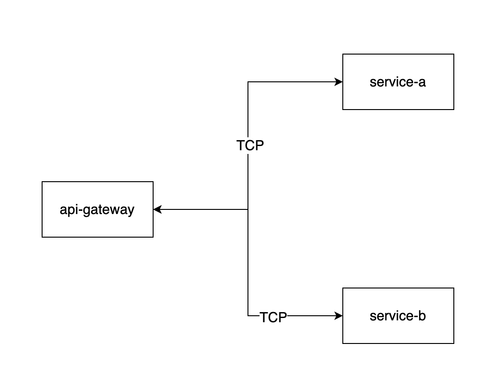

用nestjs，實作api-gateway的概念


## 參考教學資源：

- https://dev.to/thisdotmedia/build-an-api-gateway-with-nestjs-in-10-minutes-16db
- https://github.com/danmt/microservices-basics/tree/create-the-second-service

## How to start

啟動三個服務

```bash
cd api-gateway
npm run start:dev
cd ../service-a
npm run start:dev
cd ../service-b
npm run start:dev
```

呼叫 api
http://localhost:3000/ping-a
```
{
  "message": "pong",
  "duration": 1005
}
```
http://localhost:3000/ping-b
```
{
  "message": "pong",
  "duration": 2005
}
```
http://localhost:3000/ping-all
```
{
  "pongServiceA": {
    "message": "pong",
    "duration": 1018
  },
  "pongServiceB": {
    "message": "pong",
    "duration": 2012
  }
}
```
## 說明

nestjs 的 microservice 預設的 transport 是走 TCP

```ts
const app = await NestFactory.createMicroservice(AppModule, {
  transport: Transport.TCP,
  options: {
    host: "127.0.0.1",
    port: 8888,
  },
});
```

服務之間的溝通格式可以使用@nestjs/microservices的'MessagePattern'
